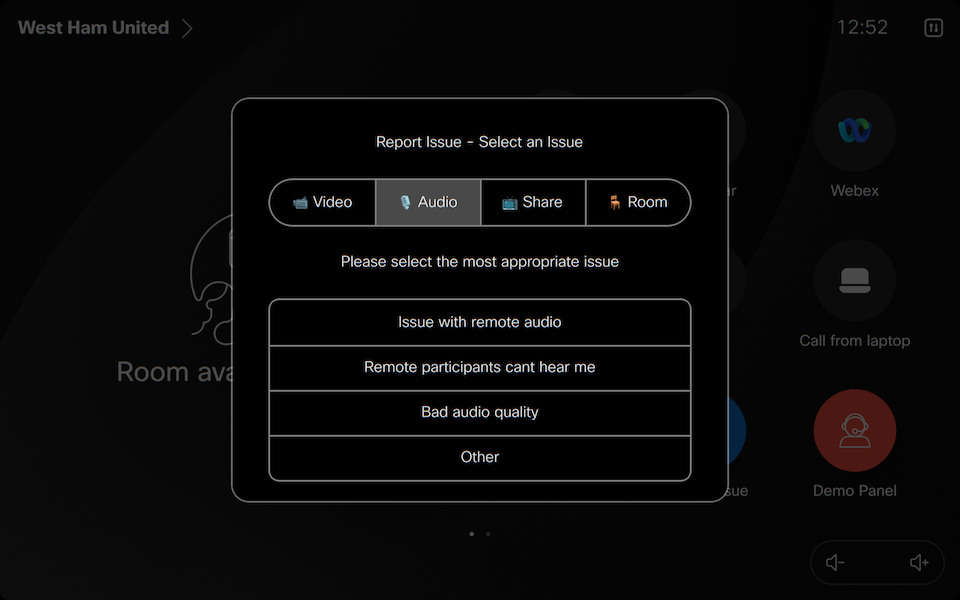
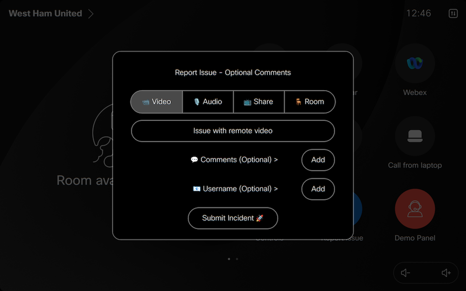
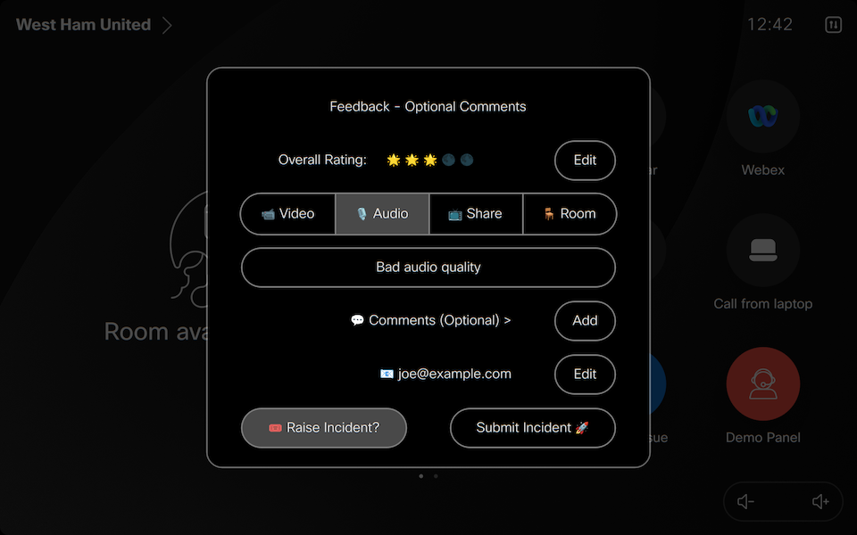

# Report Issue

 

A Cisco RoomOS Macro for capturing post-call feedback and allowing users to report room issues directly from the touch panel.

It provides a guided workflow for collecting ratings, issue categories, comments, and optional reporter details, then sending that data to one or more destinations.

## Why Use It

- Collect post-call experience feedback from the touch panel
- Let users report room or meeting issues without leaving the device
- Send results to Webex, Microsoft Teams, ServiceNow, or an HTTP endpoint
- Optionally enable log upload to Webex Control Hub for faster troubleshooting
- Customize categories, issues, ratings, and text directly in the macro

## Supported Destinations

- Webex Messaging
- Microsoft Teams
- ServiceNow
- HTTP JSON endpoints (such as Power BI or Loki)

## Screenshots

## Quick Start

1. Download `ReportIssue.js`.
2. Review and configure options and enabled services at the top of the macro.
3. Enable `debugButton` during setup so you can test without placing calls.
4. Upload the macro to your Cisco device and activate it.
5. Test the Report Issue flow and, if enabled, the post-call survey flow.
6. Confirm each enabled destination receives the expected output.

## Documentation

- Technical setup and configuration: [TECHNICAL.md](TECHNICAL.md)
- Change history: [CHANGELOG.md](CHANGELOG.md)
- Prerequisites: [TECHNICAL.md#prerequisites](TECHNICAL.md#prerequisites)
- Service processing: [TECHNICAL.md#service-processing](TECHNICAL.md#service-processing)
- Configuration reference: [TECHNICAL.md#configuration-reference](TECHNICAL.md#configuration-reference)
- Power BI fields: [TECHNICAL.md#power-bi-streaming-dataset](TECHNICAL.md#power-bi-streaming-dataset)

## Repository Files

- `ReportIssue.js` - main macro

## Support

If you find a bug, please [open an issue on GitHub](../../../issues).

## Disclaimer

This macro is provided as-is and is not guaranteed to be bug free or production ready for every environment.

## Credits

- [CiscoDevNet](https://github.com/CiscoDevNet) for [roomdevices-macros-samples](https://github.com/CiscoDevNet/roomdevices-macros-samples)
