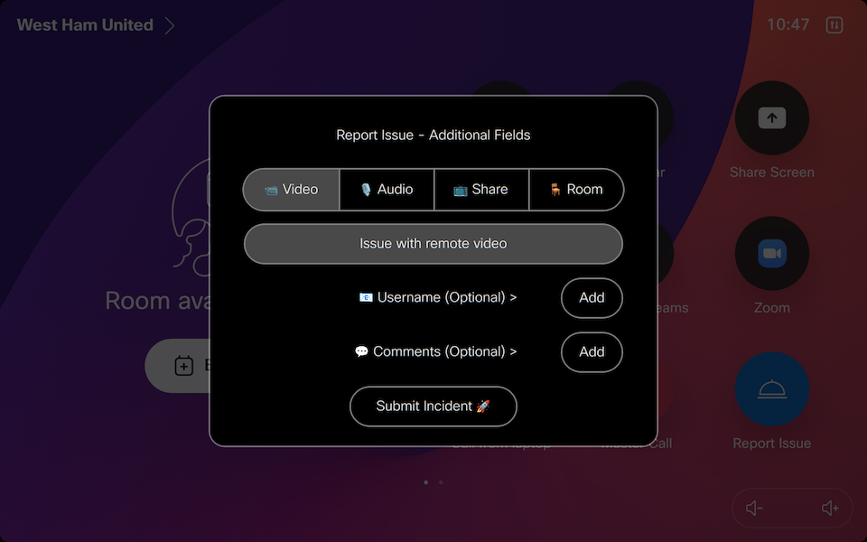
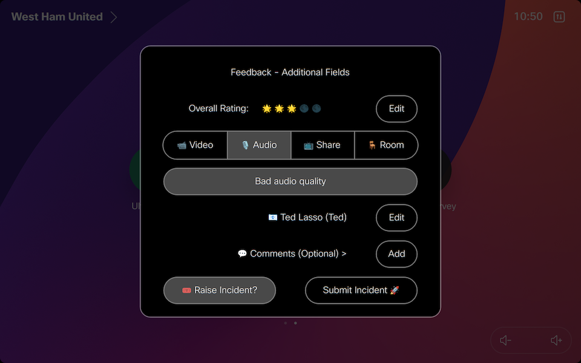

# Report Issue

Macro for capturing a users experience after a call and reporting an issue from the Touch Panel

Interactive Panel provides a guided experience for users to select the appropriate Category and Issue for reporting issues.

Captured data can be sent to the following destinations
- Webex Messaging Space
- MS Teams 'Team' Channel
- HTTP Server (such as Power Bi)
- Service Now Incident

Does not require all questions to be completed for data to be captured, any data entered will be used for processing.

The categories, issues and ratings shown can all be customized in the Macro.

Also allows for automatic upload of logs to Webex Control Hub

### Screen Shots






### Service Processing

The following table outlines how responses are processed for enabled services

`callEnabled` - Controls if Port-Call Survey will be shown
`buttonEnabled` - Controls if Report Issue button is added to the Touch Panel

| Service | Option | Requirements
| ---- | ---- | ----
| Webex | Any* | Message will be sent if Survey contains Comments
| Webex | Survey - Excellent |  Message will be sent if `webexLogExcellent` is enabled
| Webex | Survey - Average/Poor | Message will be sent
| Webex | Report Issue | Message will be sent, optionally to a separate space if defined by `webexReportRoomId`
| MS Teams | Any* | Message will be sent if Survey contains Comments
| MS Teams | Survey - Excellent |  Message will be sent if `teamsLogExcellent` is enabled
| MS Teams | Survey - Average/Poor | Message will be sent
| MS Teams | Report Issue | Message will be sent, optionally to a separate channel if defined by `teamsReportWebhook`
| Service Now | Survey - Excellent | No Incident will be raised
| Service Now | Survey - Average  | `snowTicketCall` Disabled - Incident is raised if `snowRaiseAverage` is enabled<br>`snowTicketCall` Enabled - Incident is raised if Raise Incident option is selected on Panel
| Service Now | Survey - Poor | `snowTicketCall` Disabled - Incident is raised<br>`snowTicketCall` Enabled - Incident is raised if Raise Incident option is selected on Panel
| Service Now | Report Issue | `snowTicketReport` Disabled - Incident is raised<br>`snowTicketReport` Enabled - Incident is raised if Raise Incident option is selected on Panel
| HTTP Server | Any | Output will always be sent to the HTTP Server

## Prerequisites

The following items are needed, depending on the enabled services.

### Webex Spaces**
- A Webex Bot - create at [developer.webex.com](https://developer.webex.com/my-apps/new/bot) 
- One or two new or existing Webex Spaces with the Webex bot as a member.
- Defining `webexReportRoomId` with a Room Id will send Report Issue messages (from the Report Issue button) to this separate space from Call Survey responses
- The RoomId of the destination Webex space. These example methods can be used to get the Room Id
  - Using the [List Rooms](https://developer.webex.com/docs/api/v1/rooms/list-rooms) Developer API
  - Adding `astronaut@webex.bot` to the space (bot will leave and 1:1 you the Id)
  - Start a 1:1 Conversation with `astronaut@webex.bot` and provide the space link or @mention the space

Note: You can optionally define two different spaces for Call Feedback vs Report Issue messages 

### MS Teams Channels
- One or Two MS Teams Channels configured with an [Incoming Webhook with Workflows](https://prod.support.services.microsoft.com/en-us/office/create-incoming-webhooks-with-workflows-for-microsoft-teams-8ae491c7-0394-4861-ba59-055e33f75498)
- Defining `teamsReportWebhook` with a Webhook URL will send Report Issue messages (from the Report Issue button) to this separate space from Call Survey responses

**Service Now**
- A User account with the `sn_incident_write` permission
- The URL of your Service Now instance
- Credentials for the above user account, encoded in Base64 in the following format `username:password`
- Macro searching CMDB using Serial Number to match CI Entity
- Extra Parameters (such as Assignment group) can also be passed to Service Now

**HTTP JSON**
- A remote service capable of receiving HTTP POST messages, including Power BI Streaming Dataset.
- The following format is used for the JSON Message
  ```
  {timestamp:1728875901099,system:"West Ham United",serial:"FOC1234567AB",version:"ce11.22.0.18.55610ed00ae",source:"call",rating:5,rating_fmt:"Excellent",destination:"spark:12345678901@cisco.webex.com",type:"webex",type_fmt:"Webex",duration:45,duration_fmt:"45 seconds",cause:"LocalDisconnect",category:"",category_fmt:"",issue:"",issue_fmt:"",voluntary:1}
  ```

  **Note:** If enabling the Power Bi option, the timestamp (normally Epoch) is modified to the 'DateTime' format which is supported for the streaming dataset.

  - **Power BI:** Ensure you set `httpFormat: powerBi` to ensure it is correctly formatted. The required fields in a streaming dataset are outlined below.
  - **Loki:** Ensure you set `httpFormat: loki` to ensure it is correctly formatted. The App name used in Loki will match `appName`

## Deployment

1. Download the macro file from this Repository - `ReportIssue.js`
2. Update the Parameters and Enabled Services, outlined at the top of the Macro and detailed below.
 - Recommend enabling `debugButtons` (outlined below) to assist with initial testing.
3. Upload to to your Cisco device and activate.
4. Use the buttons on the Touch Panel to test (debug and Report Issue, if enabled)
5. If enabled, make a test call (noting the minimum duration configured) and validate the Survey is shown.
6. Validate enabled services and ensure output is being received.

Logs from the Macro Console (specifically the Debug level which is not shown by default) can assist in isolating issues.

## Debugging

The macro contains two action buttons for testing the Survey without the need to make outbound calls.
- Survey Testing - Using sample call data, this will trigger the Survey on the Touch Panel
- Services Testing - Using sample call and survey data, this will trigger processing the enabled services

These action buttons can be deployed by enabling the `debugButtons` option

## Variables

### Macro Options

| Name | Type | Default | Description
| ---- | ---- | ------- | -----------
| appName | string | `reportIssue` | App Name
| widgetPrefix | string | `ri-` | Prefix used for UI Widget and Feedback Identifiers
| debugButtons | bool | `false` | Enables deployment of debugging Actions buttons designed for testing
| **Call Parameters**
| callEnabled | bool | `true` | Should calls be processed (disable to only use button)
| minDuration | num | `10` | Minimum call duration (seconds) before Survey is displayed
| **Panel Parameters**
| panelEmoticons | bool | `true` | Show emoticons on the panel
| panelComments | bool | `true` | Show comments on the panel
| panelTips | bool | `true` | Show text tips for category and issue selections
| panelUsername | bool | `true` | Username instead of Email for Panel and SNOW Caller lookup
| **Button Parameters**
| buttonEnabled | bool | `true` | Include a Report Issue button on screen
| buttonLocation | str | `HomeScreen` | Visible location of Report Issue button <br>**Options:** HomeScreen, HomeScreenAndCallControls, ControlPanel
| buttonPosition | num | `1` | Button order position
| buttonColor | str | `#1170CF` | Color code of button, default blue
| **Webex Messaging**
| webexEnabled | bool | `false` | Enable for Webex Space Message Logging
| webexLogExcellent | bool | `false` | Optionally log excellent results to Webex Space
| webexBotToken | str | ` ` | Webex Bot Token for sending messages
| webexRoomId | str | ` ` | Webex Room Id for sending messages
| webexReportRoomId | str | ` ` | If defined, report issue messages will be sent here.
| **MS Teams Messaging**
| teamsEnabled | bool | `false` | Send message to MS Teams channel when room released
| teamsLogExcellent | bool | `false` | Optionally log excellent results to MS Teams channel
| teamsWebhook | str | ` ` | URL for Teams Channel Incoming Webhook
| teamsReportWebhook | str | ` ` | If defined, report messages will be sent here.
| **HTTP Server**
| httpEnabled | bool | `false` | Enable for JSON HTTP POST Destination
| httpUrl | str | `http://localhost:3000` | HTTP Server POST URL
| httpAuth | bool | `false` | Destination requires HTTP Header for Authentication
| httpHeader | str | `Authorization: xxxxx` | Header Content for HTTP POST Authentication
| httpFormat | str | `none` | HTTP Custom Formatting - none,loki,powerBi
| **Service Now**
| snowEnabled | bool | `false` | Enable for Service NOW Incident Raise
| snowTicketCall | bool | `true` | Enabled UI Checkbox to Raise Ticket for Call Survey
| snowTicketReport | bool | `false` | Enable UI Checkbox to Raise Ticket for Report Issue
| snowRaiseAverage | bool | `false` | Raise SNOW Incident for Average Responses<br>**Note:** snowRaiseAverage is overridden by snowTicketCall if enabled.
| snowInstance | str | ` ` | Specify the base url for Service Now
| snowCredentials | str | ` ` | Basic Auth format is "username:password" base64-encoded
| snowCallerId | str | ` ` | Default Caller for Incidents, needs to be sys_id of Caller
| snowCmdbCi | str | ` ` | Default CMDB CI, needs to be sys_id of CI
| snowCmdbLookup | bool | `false` | Lookup Device using Serial Number in Service Now
| snowExtra | json | `{}` | Any extra parameters to pass to Service Now
| **Global Parameters**
| defaultSubmit | bool | `true` | Send post call results if not explicitly submitted (timeout)
| uploadLogsCallPoor | bool | `true` | Enables auto uploading of logs when a poor rating is given
| uploadLogsCallAverage | bool | `false` | Enables auto uploading of logs when an average rating is given
| uploadLogsReport | bool | `false` | Enables auto uploading of logs when submitting a report issue
| **Timeout Parameters**
| timeoutPanel | num | `20` | Timeout before initial survey panel is dismissed (seconds)
| timeoutPopup | num | `10` | Timeout before survey popups are dismissed (seconds)
| **Logging Settings**
| logDetailed | bool | `true` | Enable detailed logging
| logUnknown | bool | `false` | Show unknown extension responses in the log (useful in debugging issues)

### Language Options

| Name | Default | Description
| ----  | ---- | -----------
| categoryTip | `Please select the most appropriate category` | Tip shown when selecting a category
| issueTip | `Please select the most appropriate issue` | Tip shown when selecting an issue
| buttonText | `Report Issue` | Text of button on Touch Panel
| issuePrefix | `Report Issue` | Prefix shown for report issue titles
| feedbackPrefix | `Feedback` | Prefix shown for call survey feedback titles
| snowTerm | `Incident` | Terminology used for Incident in Service Now

### Power Bi Streaming Data Set

The following table outlines the fields required in a Power Bi API streaming dataset

| Value | Format | Comments
| ---- | ---- | ----
| timestamp | `DateTime`
| system | `String`
| serial | `String`
| version | `String`
| source | `String`
| rating | `Number`
| rating_fmt | `String`
| destination | `String`
| type | `String`
| type_fmt | `String`
| duration | `Number`
| duration_fmt | `String`
| cause | `String`
| category | `String`
| category_fmt | `String`
| issue | `Number`
| issue_fmt | `String`
| comments | `String`
| reporter | `String`
| voluntary | `Number` | 0 - False<br>1 - True

## Support

In case you've found a bug, please [open an issue on GitHub](../../../issues).

## Disclaimer

This macro is NOT guaranteed to be bug free and production quality.

## Credits

- [CiscoDevNet](https://github.com/CiscoDevNet) for creating [roomdevices-macros-samples](https://github.com/CiscoDevNet/roomdevices-macros-samples) that this is based on!
